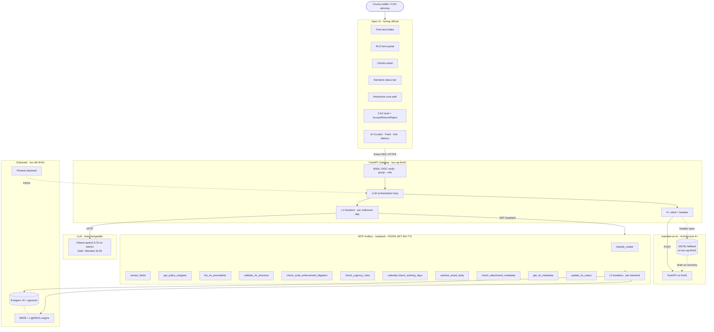

# RLS Apex — MCP-First Reframe (Design)

**Date:** 2026-05-08
**Status:** Draft for review · supersedes the v0.1.0 locked-stack assumptions for L1 / L3 / L4 / L6
**Author:** Elliot Jarbe (with Claude as scribe)

---

## 1. The reframe

RLS Apex is the **official RLS gate agent**. Not "Qwen + UI." It is a procedural LLM that uses County-aware tools to draft, check, and route Requests for Legal Services so the County Attorney's Office only sees submissions that are structurally sound and policy-compliant.

Three layers, sharply separated:

| Layer | Job |
|---|---|
| **LLM orchestrator** | Language, reasoning, drafting, narration. Calls MCP tools. Cannot override tool decisions. |
| **MCP toolbox** | Every County-specific rule, lookup, lifecycle action. Deterministic where it can be; RAG where it must be. |
| **Apex UI** | Boring, official-feeling. Surfaces statuses, checks, and cure paths. No model guts visible. |

The LLM is interchangeable. Qwen on existing Ollama (`bcc-ap-infer01`) today; a distilled Manatee SLM later. Apex doesn't care — the MCP tool surface is the contract.

---

## 2. What this replaces from the v0.1.0 locked stack

| Locked-stack choice | Replaced with | Why |
|---|---|---|
| **L1 assistant-ui** | Boring official UI: form panel, Checks panel, narrative Status, interactive Cure Path | Chat-app aesthetic is wrong for an institutional gate. Has been replaced twice already. |
| **L3 DSPy + GEPA scaffolded day 1** | LLM as orchestrator → MCP tool calls. Plain Python, typed. | Optimizer waits for redlines anyway (Lock #8). Day-1 scaffold buys nothing. |
| **L4 SGLang + Qwen2.5-14B-FP8 + Ollama + OpenAI** | Single provider. Qwen via existing Ollama on `bcc-ap-infer01` (already serving cookbook). Swap to Manatee SLM later behind unchanged MCP surface. | Multi-provider seam is premature. One model, one provider until evidence demands more. |
| **L6 Postgres + pgvector + AGE + MinIO + Azure KV + OnBase** | Postgres + pgvector. AGE replaced by recursive CTEs in lineage tool. MinIO/OnBase deferred. Azure KV stays for secrets. | AGE and MinIO are evidence-gated, not v0.1.0. OnBase integration belongs to a later phase. |
| **6 generic MCP tools** (retrieve / policy-graph / ontology / lineage / docs / report-roi) | ~12 RLS-domain MCP tools (catalog in §4). The 6 generic ones become substrate underneath. | LLM-facing API should be domain-specific. Generic tools belong in the layer below. |
| **Numeric "55/100 REJECTION PROBABILITY"** | Binary status + one-sentence narrative ("Needs fixes — 3 required items missing" / "Ready for CAO review"). | Score is illegible to attorneys and creates false precision. Tools decide; LLM narrates. |
| **"Paste a draft RLS" intake** | "What's going on?" free-text. LLM co-authors the form using `classify_matter` + `extract_fields`. | Co-authoring is the actual value. Paste-and-grade frames Apex as a judge instead of a partner. |

What stays from locked stack:

- FastAPI gateway with MSAL OIDC at `rls.mymanatee.org` (Lock #5)
- BM25 + LightRAG retrieval — now sits underneath `list_rls_precedents` and `get_policy_snippets`
- 3 hosts on county AD LAN (Lock #4 / Lock #6 host topology)
- MCP isolation pattern (Lock #7): each tool = systemd unit, RS256 JWT, loopback HTTP, per-tool Key Vault scope, two-layer circuit breakers
- Phoenix + promptfoo + Inspect AI (observability is layer-agnostic)
- **manatee-ai-roi as the single ROI surface** (Operating Rule #18 + Architecture A+) — every tool call, LLM call, and lifecycle action emits a ROI event
- Residency: no county data crosses the LAN boundary
- Lineage hash + audit row on every state change
- `domain.yaml` as schema source, but **trimmed**: `Worksheet` is no longer polymorphic in v0.1.0 (BIE / permit / hr_qa / budget_memo speculation deferred); `Matter` / `Statute` / `Opinion` / `Citation` / `Redline` / `MatterClassification` / `LineageEvent` / `ROIEvent` stay

---

## 3. Architecture



**Layer responsibilities:**

- **UI** — surfaces decisions and statuses. Never shows model output unfiltered. Components consume CSS variables (Lock #11). No chat-app aesthetic.
- **Gateway** — verifies identity, runs the LLM orchestration loop, emits ROI events, owns L1 circuit breakers (one per outbound dependency).
- **MCP toolbox** — every County-specific rule, lookup, lifecycle action. Each tool is its own systemd unit with a Key Vault scope and L2 breakers around its backends.
- **LLM** — interchangeable. Apex calls it through the OpenAI-compatible interface Ollama exposes; the Manatee SLM swap is a config change, not a code change.
- **ROI** — `manatee-ai-roi` is the single metrics surface (Operating Rule #18). Co-pilot Metrics tab queries it.
- **Substrate** — Postgres + pgvector hosts corpus, lineage, audit, RLS records. BM25 + LightRAG runs as a library inside the retrieve-related MCP tools.

---

## 4. MCP tool catalog

Each tool = its own systemd unit. FastMCP 2.0, loopback HTTP, RS256 JWT (`aud=tool.<name>`, 60s TTL), per-tool Key Vault scope. Same isolation rules as Lock #7.

### 4.1 Classification & extraction

```ts
mcp.rls.classify_matter(draftText: string): {
  type: "permit_or_zoning" | "procurement" | "public_records"
        | "code_enforcement_litigation" | "general_advisory";
  confidence: number;
}

mcp.rls.extract_fields(draftText: string): {
  subject: string;            // trimmed to ≤50 chars
  legalQuestion: string;
  factualBackground: string;
  servicesRequested: string[];
  parties: string[];
  dates: { label: string; value: string }[];
}
```

### 4.2 Policy & corpus access

```ts
mcp.rls.get_policy_snippets(topic: string, context?: object): Array<{
  source: "procedure" | "statute" | "policy" | "ldc";
  label: string;       // e.g., "RLS Electronic Submission Procedure §6(j)"
  citation: string;    // e.g., "Procedure 26-104.001(j)"
  text: string;
}>

mcp.rls.list_rls_precedents(query: {
  type?: string;
  statutes?: string[];
  freeText?: string;
  limit?: number;
}): Array<{
  rlsId: string;
  title: string;
  issueType: string;
  statutes: string[];
  outcome: "accepted" | "rejected" | "revised";
  summary: string;
  url?: string;
}>

mcp.rls.list_rls_precedents_for(rlsId: string): PrecedentHit[]
```

### 4.3 Validation (gates, not suggestions)

```ts
type ValidationIssue = {
  code: string;          // machine-readable, e.g., "MISSING_ACCOUNT_KEY"
  severity: "blocking" | "warning";
  message: string;
  field?: string;
};

type ValidationResult = {
  blocking: ValidationIssue[];
  warnings: ValidationIssue[];
};

mcp.rls.validate_rls_structure(rlsPayload: object): ValidationResult

mcp.rls.check_code_enforcement_litigation(
  rlsPayload: object,
  attachmentsMeta: object[]
): ValidationResult

mcp.calendar.check_working_days(fromDate: string, toDate: string): {
  workingDays: number;
}

mcp.rls.check_urgency_rules(rlsPayload: object): ValidationResult

mcp.rls.check_attachment_metadata(rlsId: string, kind: string): ValidationResult
```

### 4.4 Hygiene

```ts
mcp.rls.sanitize_email_body(bodyText: string): {
  cleanBody: string;
  extractedSubstantiveContent: string;
}
```

### 4.5 Lifecycle

```ts
mcp.rls.get_rls_metadata(rlsId: string): RlsMetadata

mcp.rls.update_rls_status(
  rlsId: string,
  status: "Draft" | "NeedsFixes" | "ReadyForCAO"
        | "Acknowledged" | "NeedsRevision" | "Rejected",
  reasons?: ValidationIssue[]
): void
```

`update_rls_status` writes the audit row, the lineage hash, and the ROI event in one transaction (or compensating action on failure).

### 4.6 Common contract (applies to every tool)

**Actor identity:** The gateway injects `actor_id`, `actor_role`, and `tenant` from the verified Entra OIDC JWT into every tool call as a header (`X-Apex-Actor-*`). Tool signatures shown above omit these for readability — they are not optional. Write operations refuse to execute without them.

**Error envelope** (when an L2 breaker is open or a backend fails):

```ts
type ToolErrorResponse = {
  error: { code: string; message: string };
  breaker_open?: boolean;     // true if the failure is a breaker-open response
  retry_after?: number;       // seconds; advisory only
  partial?: object;           // tool-specific best-effort payload (e.g., empty list)
};
```

Tools return HTTP 503 with this body on L2-breaker-open. Read tools include a partial result (empty list + flag); write tools return 503 with no partial.

---

## 5. User journey

### 5.0 Orchestration pattern

Per the agent-workflow-designer taxonomy, the LLM loop is **orchestrator with parallel validation fan-out**:

- **Sequential overall**: classify_matter → extract_fields → form render → on Validate → status → cure path
- **Parallel branch on Validate**: `validate_rls_structure`, `check_code_enforcement_litigation` (when classification matches), `check_urgency_rules`, and `calendar.check_working_days` run concurrently. Their results merge before the LLM narrates status.
- **Bounded handoffs**: the LLM never sees raw backend payloads. It receives the typed tool response (signatures in §4) and writes the user-facing narrative around it.
- **No tool-to-tool calls**: tools never call each other; the gateway is the only orchestrator. Each tool is independently testable and replaceable.

### 5.1 Intake — co-authoring, not pasting

User sees: "Describe the situation and what you're asking CAO to do."

LLM:
1. `classify_matter(userText)` → matter type + confidence
2. `extract_fields(userText)` → first-cut RLS payload
3. `get_policy_snippets("RLS form requirements")` → constraints (≤50 char subject, etc.)
4. Assembles a draft `rlsPayload`, surfaces it in the form panel, editable

UI copy on first render: "I've drafted an RLS from your description. Edit any field — I'll keep it compliant with the submission procedure as you go."

### 5.2 Email body sanitation — automatic

Whenever a free-text "message" or email-body field has substantive content:

```python
clean = mcp.rls.sanitize_email_body(emailBody)
if clean.extractedSubstantiveContent:
    extra = mcp.rls.extract_fields(clean.extractedSubstantiveContent)
    rlsPayload.legalQuestion = merge(rlsPayload.legalQuestion, extra.legalQuestion)
    rlsPayload.factualBackground = merge(rlsPayload.factualBackground, extra.factualBackground)
```

UI tells the user: "I moved your explanation into the RLS form so the email body stays non-substantive (RLS Electronic Submission Procedure)."

### 5.3 Continuous lint ("Grammarly for RLS")

As the user edits, LLM runs `get_policy_snippets` against the active field and shows inline guidance grounded in the snippet text. Example:

> You marked this critical/urgent, but the rule is: response needed in ≤15 working days **and** an adverse consequence if that doesn't happen. What happens if CAO responds after May 28?

Source citation always renders next to the inline note.

### 5.4 Validation — three layers

1. **Structural** — `validate_rls_structure(payload)` returns blocking + warnings.
2. **Policy/checklist** — `check_code_enforcement_litigation`, `check_urgency_rules`, plus `calendar.check_working_days`. These are gates: their `blocking` results disable Submit.
3. **Substantive precedent** — `list_rls_precedents` + `get_policy_snippets` → LLM synthesizes a pattern diagnosis. Not a gate; informs the cure path.

### 5.5 Status — narrative, not numeric

```python
blocking = structural.blocking + ce.blocking + urgency.blocking
status = "ReadyForCAO" if not blocking else "NeedsFixes"
mcp.rls.update_rls_status(rlsId, status, blocking)
```

Status bar shows a single sentence:

- "Status: Needs fixes before CAO review — 3 required items missing."
- "Status: Ready for CAO review — all required checks passed."

No "55/100." Internal scoring may exist for the ROI layer's analytics; users never see it.

### 5.6 Cure path — interactive, validated

Each cure step:

```json
{
  "step": 1,
  "title": "Attach dated approval predating the LDC amendment",
  "instruction": "Upload the original approval or resolution showing a date prior to the 2024 amendment to LDC §6.4.",
  "references": [
    { "label": "LDC §6.4 (2018 version)", "citation": "Manatee County LDC §6.4 (2018)", "source": "ldc" },
    { "label": "RLS-25-0067", "citation": "RLS-25-0067 (accepted vested-rights claim)", "source": "rls_precedent" }
  ],
  "validationTool": "check_attachment_metadata"
}
```

Mark Done → `mcp.rls.check_attachment_metadata(rlsId, "approval_document")` → if pass, step locks green and the full validation re-runs. When all blocking issues clear, status flips to `ReadyForCAO` and Submit unlocks.

### 5.7 CAO reviewer

On open:
- `get_rls_metadata(rlsId)` → matter context
- `list_rls_precedents_for(rlsId)` → similar past matters
- `get_policy_snippets("relevant statutes and policies", { rlsId })` → applicable law

LLM produces:
- **Brief** (3–5 bullets): issue, key facts, posture, deadlines, requested services
- **Risk section**: structural defects + substantive weaknesses
- **Suggested next steps**: clearly marked as suggestions

Decisions are buttons:
- Accept → `update_rls_status(rlsId, "Acknowledged")`
- Return → `update_rls_status(rlsId, "NeedsRevision", reasons)`
- Reject → `update_rls_status(rlsId, "Rejected", reasons)`

After click, LLM drafts the requester notification (for Return/Reject) and updates the Co-pilot Feed with a human-readable rationale.

### 5.8 AI Co-pilot

Three tabs:

| Tab | Source |
|---|---|
| **Feed** | Natural-language log of every MCP call for this matter (tool name, args summary, result summary, timestamp). Sourced from the gateway's per-action audit + ROI events. |
| **Ask** | Chat scoped to **this RLS only**, with full tool access. Examples: "Show me three similar accepted RLSs." "Draft a note explaining why we need a BIE." |
| **Metrics** | **manatee-ai-roi.** Queries the ROI dataset filtered to this matter or rolled up across the quarter. No separate metrics surface. |

---

## 6. ROI integration (Rule #18)

Every emit point is a `manatee-ai-roi` event using schema 1.1.0 (`event_kind` enum). Same Architecture A+ as already wired in `apps/gateway/sidecar/_client.py`.

| Event point | event_kind | Notes |
|---|---|---|
| LLM call (intake, lint, brief, cure-path narration) | `llm_call` | tokens + duration |
| MCP tool call (each of the ~12 RLS-domain tools) | `tool_invocation` | `tool=<systemd_unit>`, success bool |
| Precedent retrieval hit | `rag_hit` | from `list_rls_precedents` and `get_policy_snippets` |
| Status transition | `tool_invocation` (`tool=update_rls_status`) | NeedsFixes → ReadyForCAO → Acknowledged/NeedsRevision/Rejected |
| Cure step marked done | `tool_invocation` (`tool=cure_step_validate`) | one event per step validation |
| Co-pilot Ask query | `llm_call` + `tool_invocation`s | inherits scope from RLS |

All events flow through Architecture A+: POST primary to `manatee-ai-roi` FastAPI; local-fallback JSONL on `bcc-ap-llm01` when the breaker opens; background drain on recovery.

The Co-pilot Metrics tab reads from the ROI dataset via a gateway endpoint, not from a separate store.

---

## 7. v0.2 scope (the first slice that ships)

This reframe is bigger than the original 2-week Lock #9 target. Slice tightly:

### v0.2.0 (target: 1 week)

- Intake free-text + `classify_matter` + `extract_fields` (mock implementations OK — return canned classifications)
- Form panel renders the assembled draft, editable
- `validate_rls_structure` (real implementation against `domain.yaml`)
- Status panel: narrative only, no numeric score
- Cure path UI scaffold (steps render, mark-done is no-op)
- CAO view: stub brief from canned data
- Co-pilot Feed tab pulling from gateway audit log
- ROI events firing for everything above
- LLM is Qwen via existing Ollama; no SGLang, no Manatee SLM
- Postgres + pgvector only

### v0.2.1 (target: +1 week)

- `check_code_enforcement_litigation` real
- `check_urgency_rules` + `calendar.check_working_days` real
- `list_rls_precedents` against redacted 50-opinion corpus (Lock #9's week-2 condition)
- `get_policy_snippets` against Procedure 26-104.001 + LDC excerpts
- Cure path mark-done re-runs validation
- Co-pilot Ask tab (LLM + scoped tool access)
- `update_rls_status` writes audit row + lineage hash + ROI event
- Co-pilot Metrics tab reading from `manatee-ai-roi`

### Post-v0.2

- `sanitize_email_body`
- Continuous lint on every field
- Manatee SLM swap (when ready)
- DSPy + GEPA optimization compile (Lock #8 unchanged: gated on ≥50 attorney redlines)
- Reviser agent + matter-draft surface

---

## 8. Non-goals for v0.2

- **AGE / Cypher graph** — replaced by recursive CTEs and FK joins
- **MinIO** — attachments live as `bytea` columns or filesystem; revisit if attachment volume forces it
- **OnBase integration** — out of scope until pilot proves out
- **Multi-provider inference seam** — one provider, one model
- **DSPy + GEPA scaffold** — plain Python orchestration; revisit only when redlines exist
- **Polymorphic Worksheet** (`BIE | permit | hr_qa | budget_memo`) — `Matter` and `RLS` only. Add the polymorphism later if other pilots actually demand the same shape.
- **assistant-ui** — never installed, never imported. Build the boring official surface from scratch.
- **PostHog** — Lock #1 unchanged

---

## 9. Open questions

1. **MCP tool count** — 12+ tools is a lot to operate solo. Some could collapse (e.g., `validate_rls_structure` and `check_urgency_rules` could be one tool). Decision: start with 12 separate; collapse only if operating cost shows up.
2. **Free-text vs structured intake fallback** — some users may want to paste an existing draft directly. Allow both, but the primary surface is "What's going on?"
3. **Cure path step types** — only "attach a doc" and "edit a field" are obvious. Are there others (sign an attestation, request a calendar slot)? Defer until real cases.
4. **Co-pilot Ask scope** — should it be able to call `update_rls_status` (write actions) or only read tools? Default: read-only. Attorneys click buttons for state changes.
5. **Manatee SLM swap criteria** — when do we declare Qwen "good enough" vs trigger the SLM swap? Tied to redline volume from the pilot group.

---

## 10. Hard constraints (unchanged from CLAUDE.md / DECISION_LOG.md)

- **Residency** — no county data crosses the LAN boundary
- **Rule #18** — every user-facing action emits a ROI event via Architecture A+
- **Rule #19** — every external dependency wraps in a circuit breaker
- **Lock #5** — Entra OIDC at `rls.mymanatee.org`, independent from cookbook auth chain
- **Lock #7** — MCP tools = separate systemd units, RS256 JWT, loopback, two-layer breakers
- **Lock #8** — GEPA compile waits for ≥50 attorney redlines
- **Lock #11** — `_base.css` + `_brand-overlay.css`; components consume CSS variables, never hex literals

---

## 11. Non-functional requirements

| NFR | Target (v0.2) | Notes |
|---|---|---|
| Availability | 99.5% during business hours (M–F 8:00–17:00 ET); no formal off-hours commitment | Single-host SPOF accepted for v0.2; revisit at v0.3 |
| Latency · paste → first status | ≤ 5s p95 | LLM-bound; Ollama qwen2.5:7b on shared L4 |
| Latency · MCP tool call | ≤ 200ms p95 | Loopback HTTP + JWT verify |
| Latency · validation panel update | ≤ 1s p95 | Validation tools are pure rules; no LLM in path |
| Throughput | 10 concurrent users · 50 RLS submissions/day | Pilot scale; not production scale |
| Residency | County AD LAN only | No external egress in default config (Lock #4 OpenAI fallback disabled) |
| Auditability | Every state change writes audit row + lineage hash + ROI event | Atomic with `update_rls_status` or compensating action |
| Recoverability · data | `pg_basebackup` nightly to a second host; ROI fallback JSONL on `bcc-ap-llm01` | Manual recovery acceptable for v0.2 |
| Recoverability · config | All systemd units + nginx + Ollama config in git | Reprovision a host from repo + Ansible/script in ≤ 4 hrs |
| Security · authN | Entra OIDC at gateway; group claim → role | Lock #5 |
| Security · authZ between gateway and MCP tools | RS256 JWT, `aud=tool.<name>`, 60s TTL, per-tool Key Vault scope | Lock #7 |
| Observability | Phoenix per LLM call; promptfoo CI; Inspect AI nightly; ROI event per action | All four exist already |
| Operability | One operator (the user); all units under systemd; reboot-survivable | Runbook covers boot order |
| Cost | Zero external API spend in v0.2 | Azure Key Vault is the only paid SaaS dependency |
| Orchestration · max tools per turn | 8 | Hard cap to prevent runaway loops; classification + extraction + 4 validators + 2 retrievals fits |
| Orchestration · LLM context per turn | 16k tokens | Qwen2.5:7b's effective context; gateway truncates / summarizes prior turns to fit |
| Orchestration · output schema gate | 100% of LLM payloads passed to UI | Every assembled `rlsPayload` validates against the `domain.yaml`-derived Pydantic model before reaching the form panel; failures surface as a retry, not a UI error |
| Orchestration · transient retry inside breaker-closed | 1 retry, 200ms backoff, idempotent ops only | Counts toward breaker threshold only after the retry also fails |

## 12. Circuit breaker design

Lock #7 commits to two layers. This section makes the layout, thresholds, and fallbacks concrete for v0.2.

### 12.1 Layer 1 (gateway-side) — one breaker per outbound dependency

| Boundary | Threshold | Open duration | Fallback | Notes |
|---|---|---|---|---|
| Gateway → Ollama | 5 fails / 30s window | 30s, then single half-open probe | Return `503` to UI with "AI service unavailable, retry shortly"; surface in Status bar; no degraded silent path | Residency forbids OpenAI fallback in v0.2 |
| Gateway → `manatee-ai-roi` POST | 5 consecutive fails | 30s, then single probe | JSONL fallback on `bcc-ap-llm01` (Architecture A+, already implemented in `apps/gateway/sidecar/_client.py`) | Telemetry must never block user actions |
| Gateway → MCP tool (each of 12) | 5 fails / 30s | 30s, then probe | Per-tool: read tools return empty + warning; write tools (`update_rls_status`) fail loudly | One breaker per tool, not one breaker for the whole toolbox |

### 12.2 Layer 2 (tool-side) — one breaker per backend each tool calls

| Tool | Backend | Threshold | Fallback |
|---|---|---|---|
| `list_rls_precedents` | Postgres + pgvector + retrieval engine | 5 fails / 30s | Empty list + `breaker_open=true` flag in response |
| `get_policy_snippets` | Postgres + retrieval engine | 5 fails / 30s | Empty list + `breaker_open=true` flag in response |
| `update_rls_status` | Postgres (write path) | 5 fails / 30s | Fail loudly — state transitions cannot be silently degraded |
| `get_rls_metadata` | Postgres (read path) | 5 fails / 30s | Cached last-known + staleness flag |
| `calendar.check_working_days` | Embedded calendar table | 5 fails / 30s | Conservative estimate (treat unknown days as non-working) |
| `validate_rls_structure` | Pure logic against `domain.yaml` | n/a | n/a |
| `check_*` (CE / urgency / attachment) | Pure logic | n/a | n/a |

Pure-logic tools don't need a backend breaker; they fail-fast on input validation errors and surface those as `blocking` issues.

### 12.3 States and transitions

```
closed ──[5 fails / 30s]──▶ open
open ──[30s elapsed]──▶ half-open
half-open ──[probe success]──▶ closed
half-open ──[probe fail]──▶ open
```

Implementation: a small breaker library inside `apps/gateway/circuit/` shared by the gateway and (vendored) by each MCP tool. Pattern matches the existing ROI client in `_client.py` so the operator has one mental model.

### 12.4 Health surface

The gateway already exposes `/api/health/sidecar` for the ROI breaker. Extend with:

- `GET /api/health/breakers` — returns all L1 breakers with `{ name, state, consecutive_failures, last_failure_ts, last_success_ts }`
- Each MCP tool exposes `GET /health` with its L2 breakers in the same shape
- Aggregate dashboard tile: gateway scrapes each tool's `/health` on the loopback every 15s and rolls up

### 12.5 Monitoring & alerts

- **Phoenix** — span attribute `breaker.state` on every spanned call; transition events as span events
- **ROI** — when a breaker is open, the resulting `tool_invocation` or `llm_call` event carries `success=false` and `error_class=breaker_open`
- **Power BI** (when wired) — tile: "% of requests with any breaker open in the last hour"
- **Alert** — any breaker stays open > 5 minutes during business hours → operator notification; > 15 minutes → escalate

## 13. Risks and mitigations

| # | Risk | Likelihood | Impact | Mitigation |
|---|---|---|---|---|
| 1 | GPU contention with cookbook on shared `bcc-ap-infer01` (both want Qwen 7B) | Medium | Medium | SGLang radix cache shares prompt prefixes; queue at gateway if contention shows; long-term swap to Manatee SLM (smaller) |
| 2 | `manatee-ai-roi` FastAPI not yet deployed on `bcc-ap-llm01` — Co-pilot Metrics blocked | High (today) | Low | Architecture A+ JSONL fallback works without the API; Metrics tab returns "data warming up" until deploy lands |
| 3 | 12 MCP tools = 12 systemd units to keep alive solo | Medium | Medium | Roll out 4 tools in v0.2.0, 4 more in v0.2.1, last 4 post-pilot; collapse adjacent tools (e.g., `validate_rls_structure` + `check_urgency_rules`) if operating cost shows up |
| 4 | Reframe scope creep — pressure to add DSPy/GEPA/AGE/MinIO during build | Medium | High | ADRs explicitly say "evidence-gated"; require a new Lock to override; track in Open Questions |
| 5 | Real corpus delays from County Attorney push v0.2.1 out | Medium | High | v0.2.0 ships with 5-opinion synthetic corpus; Carlos sign-off remains the critical path for v0.2.1 |
| 6 | LLM hallucinates statute citations in pattern diagnosis | Medium | High | Every pattern claim must reference a `list_rls_precedents` or `get_policy_snippets` result. Inspect AI eval gates merges. promptfoo CI catches regressions on canonical examples. |
| 7 | `bcc-ap-infer01` SPOF | Low | High | v0.2 accepts; gateway returns user-friendly "service unavailable" rather than silently flipping to OpenAI (residency wins). v0.3 plans dedicated capacity. |
| 8 | Boring-official UI doesn't read as "official" to County staff | Low | Medium | Visual review with Drew + 1–2 staff during v0.2.0; iterate on copy and visual hierarchy before stakeholder demo |
| 9 | Continuous lint feels intrusive ("paperclip effect") | Low | Medium | Default off; user enables per-field; lint events emit as `tool_invocation` so usage is measurable |
| 10 | RS256 JWT key rotation breaks MCP calls | Low | High | Key rotation runbook in `RUNBOOK.md`; gateway accepts both old + new keys for a 30-day overlap |

## 14. Architectural decisions

Locks #13–#18 in [`DECISION_LOG.md`](../../../DECISION_LOG.md) carry the full `Decision · Rationale · Reversal cost` text for each decision in this reframe. They supersede v0.1.0 stack assumptions for L1 / L3 / L4 / L6 and do not touch Lock #2 (repo location), Lock #5 (auth), Lock #7 (MCP isolation pattern), or Lock #11 (token strategy).

## Review notes

**To validate:**
- Does the boring-official UI direction match what stakeholders expect to see?
- Is the v0.2.0 / v0.2.1 split realistic against the existing repo state?
- Are the 12 MCP tool boundaries correct, or are some too small / too large?
- Does the Co-pilot Metrics tab's dependency on `manatee-ai-roi` work for the demo timeline (manatee-ai-roi FastAPI is not yet deployed on llm01)?

**Spec scope:** This document covers L1 / L3 / L4 / L6 reframe + the user journey. It does **not** rewrite Lock #2 (repo location), Lock #5 (auth), Lock #7 (MCP isolation pattern), Lock #11 (token strategy) — those stand.
