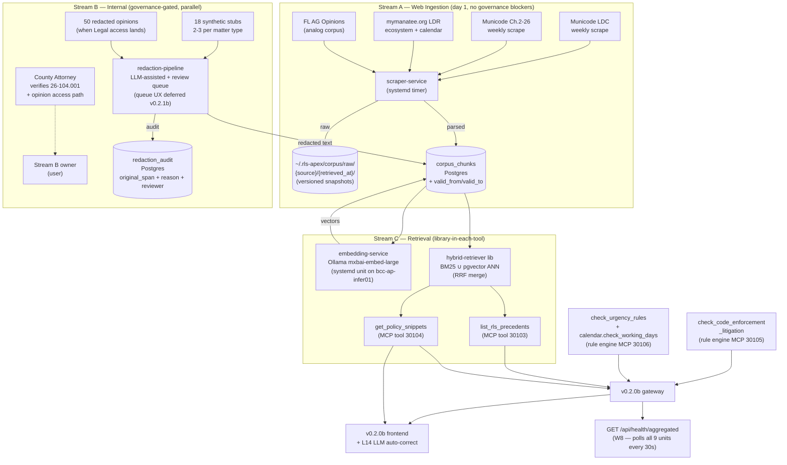

# RLS Apex v0.2.1a — Real Validators + Retrieval Corpus — Design Spec

**Spec date:** 2026-05-11
**Branch:** continue on `feat/v0.2.0a-backend` (will branch to `feat/v0.2.1a` at writing-plans time)
**Predecessor:** v0.2.0b shipped on `feat/v0.2.0a-backend` HEAD `5c359a1` (64 backend + 50 frontend + 2 E2E + 7 visual baselines green)
**Companion specs:**
- `2026-05-08-rls-apex-mcp-reframe-design.md` (canonical reframe spec, 642 lines)
- `2026-05-08-roi-emit-contract-hardening-design.md` (Rule #18 ADRs)
- `2026-05-08-v0_2_0b-frontend-design.md` (frontend layer this builds against)
**Runbook:** `docs/runbooks/2026-05-09-rls-apex-v0_2_0b-runbook.md` (ops state + lessons learned)

---

## 1. Goal + scope

Wire the real validators + retrieval corpus into the v0.2.0b gateway + MCP tool framework. Replaces three v0.2.0b mocks with real implementations (L1, L2 rule-engined; L3, L4 corpus-retrieved) and extends frontend auto-correct (L14) to LLM-driven policy lookups. Three parallel work streams.

**Concrete deliverables:**

- **Stream A — web ingestion** — `scraper-service` (Python systemd unit, weekly timer) for Municode LDC + Code of Ordinances Ch. 2-26 + mymanatee.org LDR ecosystem + Florida AG Opinions analog corpus. Output: `corpus_chunks` Postgres rows with `valid_from`/`valid_to` snapshots.
- **Stream B — internal opinions + Procedure 26-104.001** — `redaction-pipeline` service (LLM-assisted detection + human review queue) against 18 synthetic stubs initially; real opinions when Legal access is granted. Procedure 26-104.001 source TBD (case 3 — verify with County Attorney).
- **Stream C — retrieval engine** — `hybrid-retriever` library (BM25 ∪ pgvector ANN, RRF-merged) loaded into each retrieval-related MCP tool process. Wires L3 (`list_rls_precedents`) + L4 (`get_policy_snippets`).
- **L1** — `check_code_enforcement_litigation` rule engine (CE keyword list + classification gate).
- **L2** — `check_urgency_rules` + `calendar.check_working_days` rule engine (county working-days calendar from `mymanatee.org`).
- **L14** — frontend `auto-correct.js` extended with LLM-driven rules calling L4 `get_policy_snippets`.
- **W8** — gateway `GET /api/health/aggregated` polling all 9 MCP tool processes (promoted from contract-hardening backlog into v0.2.1a).

**Non-goals (deferred):**

- L5 (cure-path mark-done re-validation) → v0.2.1b
- L7 (`update_rls_status` atomic protocol — audit + lineage + ROI in one tx) → v0.2.1b
- L9 (real DSPy chain replacing `prompt_tokens=0` placeholders) → v0.2.1b
- L6 (Co-pilot Ask tab) → v0.2.1c
- L8 (Co-pilot Metrics tab) → v0.2.1c
- L10 (JWT dept + role_band claims) → v0.2.1c
- L11 (Feed swap to gateway audit endpoint) → v0.2.1c
- L13 (CAO route Entra group gating) → v0.2.1c
- Retrieval eval harness with 50 hand-labeled query/relevance pairs → v0.2.1b
- Redaction review queue UX → v0.2.1b
- Service worker / offline mode → out of scope

---

## 2. Locked constraints (from brainstorm)

| # | Constraint | Source |
|---|---|---|
| C1 | 3-stream decomposition (A web ingestion, B internal opinions, C retrieval) | Brainstorm + friend's research |
| C2 | Stream B governance-gated; engineering proceeds on 18 stubs while Legal access is requested | ADR-003 |
| C3 | Hybrid retrieval from day 1 (BM25 ∪ pgvector ANN via RRF) — NOT BM25-only | ADR-001 |
| C4 | Versioned corpus snapshots (`valid_from`/`valid_to` range) | ADR-002 |
| C5 | 18 synthetic stub opinions (2-3 per matter type from spec §4.1 enum) | ADR-003 |
| C6 | W8 (gateway `/health` aggregation) promoted from contract-hardening backlog | ADR-004 |
| C7 | Embedding model: `mxbai-embed-large` via local Ollama on `bcc-ap-infer01` | ADR-005 (residency + open-weights) |
| C8 | Library-in-each-tool retrieval (§15 W3 default; revisit if index > 2GB) | ADR-006 |
| C9 | Operating Rule #18 — every retrieval emits `rag_hit` ROI event | CLAUDE.md |
| C10 | Operating Rule #19 — every external dep wraps a breaker (scraper→Municode, embedding→Ollama, retrieval→Postgres) | CLAUDE.md |
| C11 | Lock #7 — per-tool systemd unit + RS256 JWT + loopback + two-layer breakers | Reframe spec §10 |
| C12 | County residency — no external egress in default config; all inference + embeddings local-LAN | Reframe NFR §11 |
| C13 | Manatee County Municode + mymanatee.org scrape is permitted (R1 verified by user) | This session |
| C14 | Procedure 26-104.001 source unknown; treat as case 3, build assuming internal, verify with Legal | Friend's research + brainstorm |

---

## 3. Architecture

### 3.1 Component graph



### 3.2 Project layout

```
rls-apex-v1/
├── apps/
│   ├── gateway/
│   │   ├── main.py                 + new endpoint: GET /api/health/aggregated (W8)
│   │   └── ...                     (unchanged from v0.2.0b)
│   └── web/
│       └── static/core/automation/
│           └── auto-correct.js     + L14 LLM rule (calls L4 via gateway)
├── mcp_tools/
│   ├── _lib/
│   │   ├── corpus/                 NEW — shared corpus library
│   │   │   ├── retriever.py        hybrid BM25 + pgvector ANN via RRF
│   │   │   ├── chunker.py          paragraph + section-header chunking
│   │   │   ├── embed_client.py     Ollama embedding client (breaker-wrapped)
│   │   │   └── schema.py           Pydantic models for corpus_chunks
│   │   └── ...                     (unchanged)
│   ├── classify_matter/            (unchanged)
│   ├── validate_rls_structure/     (unchanged)
│   ├── extract_fields/             (unchanged)
│   ├── list_rls_precedents/        NEW — port 30103
│   ├── get_policy_snippets/        NEW — port 30104
│   ├── check_code_enforcement_litigation/  NEW — port 30105
│   ├── check_urgency_rules/        NEW — port 30106 (includes calendar.check_working_days)
│   └── ...
├── services/                       NEW top-level dir for long-running non-tool services
│   ├── scraper/                    Stream A — weekly Municode/mymanatee/FL-AG scrape
│   │   ├── service.py              entrypoint
│   │   ├── sources/                per-source scraper modules
│   │   │   ├── municode_ldc.py
│   │   │   ├── municode_ch2_26.py
│   │   │   ├── mymanatee_ldr.py
│   │   │   └── fl_ag_opinions.py
│   │   ├── normalize.py            chunking + metadata extraction
│   │   ├── persist.py              versioned write to corpus_chunks
│   │   └── tests/
│   ├── redaction/                  Stream B — LLM-assisted PII/privilege redaction
│   │   ├── pipeline.py             entrypoint
│   │   ├── detectors/              LLM + NER detectors
│   │   ├── audit.py                writes redaction_audit rows
│   │   └── tests/
│   └── embedding/                  Stream C — Ollama wrapper service
│       ├── service.py              FastAPI on port 30200
│       ├── client.py               (used by mcp_tools/_lib/corpus/embed_client.py)
│       └── tests/
├── alembic/versions/
│   ├── <new>_corpus_chunks_versioned.py     valid_from + valid_to + sha256 + source_id
│   └── <new>_redaction_audit.py             original_span + redaction_reason + reviewer_upn
├── corpus-data/                    NEW (gitignored except for stubs)
│   ├── stubs/                      18 synthetic opinion fixtures (committed)
│   ├── raw/                        scraped HTML/PDF snapshots (gitignored)
│   └── processed/                  normalized chunks before DB load (gitignored)
├── tests/
│   ├── test_corpus_retriever.py    NEW
│   ├── test_scraper_*.py           NEW per source
│   ├── test_redaction_pipeline.py  NEW
│   ├── test_list_rls_precedents.py NEW
│   ├── test_get_policy_snippets.py NEW
│   ├── test_check_ce_litigation.py NEW
│   ├── test_check_urgency_rules.py NEW
│   └── test_health_aggregated.py   NEW (W8)
└── docs/
    ├── superpowers/specs/
    │   └── 2026-05-11-v0_2_1a-design.md   (this file)
    └── runbooks/
        └── 2026-05-11-v0_2_1a-runbook.md  (written at v0.2.1a ship)
```

### 3.3 Database schema additions

```sql
-- New: corpus_chunks (Stream A produces, Stream C reads)
CREATE TABLE corpus_chunks (
    id BIGSERIAL PRIMARY KEY,
    source_id TEXT NOT NULL,           -- "municode.ldc.6.4", "fl-ag.2023-08", etc.
    source_type TEXT NOT NULL,         -- "ldc" | "ordinance" | "fl_ag_opinion" | "internal_opinion" | "procedure" | "calendar"
    section_path TEXT NOT NULL,        -- "Chapter 6 / §6.4 / (a)(2)"
    citation TEXT NOT NULL,            -- "Manatee County LDC §6.4(a)(2) (2024)"
    body TEXT NOT NULL,                -- the chunk text (paragraph + section-header context)
    sha256 TEXT NOT NULL,              -- for change detection
    valid_from TIMESTAMPTZ NOT NULL,   -- when this version became current
    valid_to TIMESTAMPTZ,              -- NULL = current; set when superseded
    embedding vector(1024),            -- pgvector — mxbai-embed-large dim
    metadata JSONB NOT NULL DEFAULT '{}',
    created_at TIMESTAMPTZ NOT NULL DEFAULT NOW()
);

CREATE INDEX idx_corpus_chunks_current ON corpus_chunks(source_type, source_id) WHERE valid_to IS NULL;
CREATE INDEX idx_corpus_chunks_bm25 ON corpus_chunks USING GIN (to_tsvector('english', body));
CREATE INDEX idx_corpus_chunks_hnsw ON corpus_chunks USING hnsw (embedding vector_cosine_ops);

-- New: redaction_audit (Stream B writes)
CREATE TABLE redaction_audit (
    id BIGSERIAL PRIMARY KEY,
    source_doc_id TEXT NOT NULL,       -- original internal doc identifier
    chunk_id BIGINT REFERENCES corpus_chunks(id),
    original_span_start INT NOT NULL,
    original_span_end INT NOT NULL,
    original_text TEXT NOT NULL,       -- the redacted span (encrypted at rest, optional)
    redaction_reason TEXT NOT NULL,    -- enum: pii_name | pii_address | pii_dob | privileged | other
    detector TEXT NOT NULL,            -- "llm:mxbai" | "regex:ssn" | "human"
    reviewer_upn TEXT,                 -- human reviewer who approved (NULL until reviewed)
    reviewed_at TIMESTAMPTZ,
    created_at TIMESTAMPTZ NOT NULL DEFAULT NOW()
);

CREATE INDEX idx_redaction_audit_pending ON redaction_audit(reviewer_upn) WHERE reviewer_upn IS NULL;
```

---

## 4. Stream A — Web ingestion

### 4.1 Sources (in v0.2.1a scope)

| Source | URL pattern | Format | Update cadence | Scrape via |
|---|---|---|---|---|
| Municode LDC | `library.municode.com/fl/manatee_county/codes/land_development_code` | HTML | Quarterly+ | requests + BS4 |
| Municode Ch. 2-26 | `library.municode.com/fl/manatee_county/codes/code_of_ordinances` Ch. 2-26 | HTML | Annual+ | requests + BS4 |
| mymanatee.org LDR | `mymanatee.org/services-and-amenities/service-listing/service-details/view-land-development-regulations` + linked pages (Dev Review Manual, Comp Plan, 2015 rewrite history) | HTML + PDFs | Annual+ | requests + BS4 + pdfminer |
| mymanatee.org calendar | County working-days / holidays page | HTML | Annual | requests + BS4 |
| FL AG Opinions | `myfloridalegal.com/ag-opinions` index + per-opinion pages | HTML | Monthly+ | requests + BS4 |

Out of scope for v0.2.1a: Justia case law (too broad), MRSC (WA-specific), case law repos.

### 4.2 Scraper architecture

```
services/scraper/service.py (systemd-managed weekly timer)
  → for each source in SOURCES:
      → fetch index/listing page (breaker-wrapped per host)
      → diff against last-known sha256 list (skip unchanged)
      → for each changed doc:
          → fetch HTML/PDF
          → save raw to ~/.rls-apex/corpus/raw/{source}/{retrieved_at_iso}/...
          → chunk via normalize.py (paragraph + section-header context)
          → compute sha256 per chunk
          → persist:
              - new sha256 → INSERT corpus_chunks (valid_from=NOW, valid_to=NULL)
              - existing sha256 with NULL valid_to → no-op
              - existing sha256 superseded → UPDATE old row valid_to=NOW, INSERT new row
          → emit ROI event: tool_invocation, workflow=rls_apex.scrape, surface=other, extra={source, chunks_added, chunks_superseded}
```

### 4.3 Chunking strategy

Paragraph-level chunks with section-header context. Each chunk includes:

- **`body`** — the paragraph text (target 200-800 tokens)
- **`section_path`** — full hierarchy (`Chapter 6 / §6.4 / (a)(2)`)
- **`citation`** — formatted citation string (`Manatee County LDC §6.4(a)(2) (2024)`)
- **`metadata`** — JSONB with `{source_url, retrieved_at, anchor_id, page_number?}`

Rationale: legal text has natural paragraph boundaries; preserving section-header context lets the LLM disambiguate citations without re-fetching adjacent text.

### 4.4 Breaker behavior (Rule #19)

One breaker per source host (`municode`, `mymanatee`, `myfloridalegal`):
- Failure threshold: 3 consecutive 5xx/network errors
- Open duration: 1 hour (next weekly scrape skips this host)
- Half-open probe: single retrieve attempt; success closes, failure re-opens 1 hour

Breaker state surfaces in `GET /api/health/aggregated` (W8).

---

## 5. Stream B — Internal opinions + Procedure 26-104.001

### 5.1 Governance activities (process, not engineering)

| Activity | Owner | Acceptance |
|---|---|---|
| Verify 26-104.001 source (codified Ch. 2-26 / internal admin / both) | User → County Attorney | Email response on record; result drives whether L4 procedure-snippets uses scraper output or internal-doc pipeline |
| Identify 50 opinions owner + access path | User → County Attorney | Documented access path (matter system, file share, etc.); access credentials provisioned |
| Approve redaction category schema | User → County Attorney + records officer | Sign-off on the `redaction_reason` enum + thresholds for human-review vs auto-redact |
| Designate redaction reviewers (named UPNs) | User → Legal | List of UPNs authorized to set `reviewer_upn` in `redaction_audit` |

Tracked in `pending_work.md` under "RLS Apex v1 — v0.2.1a Stream B governance".

### 5.2 18 synthetic stub opinions (unblocks Stream C)

| Matter type (from spec §4.1) | Stub count | Includes |
|---|---|---|
| code_enforcement_litigation | 3 | NOV references, vested-rights claims, special-magistrate citations |
| permit_or_zoning | 3 | LDC §6.4-style citations, pre-amendment approvals |
| procurement | 3 | Ch. 2-26 references, RFP/contract dispute patterns |
| public_records | 3 | Ch. 119 citations, journalist requests, redaction history |
| general_advisory | 3 | Ethics, Sunshine Law, Code of Ordinances citations |
| Other | 3 | Edge cases: mixed matter types, deprecated citations, ambiguous classification |

Each stub: 800-1500 words. Hand-crafted to include realistic PII spans + privileged-info markers (Bates labels, attorney-client work product flags) so the redaction pipeline has work to do.

Committed under `corpus-data/stubs/` (NOT gitignored — these are test fixtures).

### 5.3 Redaction pipeline architecture

```
services/redaction/pipeline.py
  → INPUT: PDF or text from internal source (or stub from corpus-data/stubs/)
  → STAGE 1 — Detection:
      → regex detectors: SSN, phone, email, Bates labels (high-confidence patterns)
      → LLM detector (Ollama chat model): "extract spans containing PII, privileged work product, or unredacted opposing-party identifiers"
      → merge spans into normalized list
  → STAGE 2 — Audit write:
      → INSERT redaction_audit row per span with reviewer_upn=NULL (pending)
      → encrypt original_text at rest if span is sensitive
  → STAGE 3 — Human review (deferred to v0.2.1b for UX; for v0.2.1a, reviewer manually queries DB and updates):
      → reviewer reads pending rows, sets reviewer_upn + reviewed_at
      → reviewer can override (mark as not-actually-PII)
  → STAGE 4 — Apply + ingest:
      → only spans with reviewer_upn IS NOT NULL are applied
      → redacted text written to corpus_chunks
      → ROI event emitted
```

### 5.4 Redaction reason enum

```python
class RedactionReason(str, Enum):
    pii_name = "pii_name"           # individual names not party to the matter
    pii_address = "pii_address"
    pii_dob = "pii_dob"
    pii_ssn_or_id = "pii_ssn_or_id"
    pii_contact = "pii_contact"     # phone, email
    privileged = "privileged"        # attorney-client, work product
    settlement_terms = "settlement_terms"
    ongoing_litigation = "ongoing_litigation"
    other = "other"
```

Subject to County Attorney + records officer sign-off (S2 §5.1).

---

## 6. Stream C — Retrieval engine

### 6.0 Naming note — "BM25"

For brevity this spec uses "BM25" as a stand-in for **sparse lexical retrieval**, but the v0.2.1a implementation uses Postgres `ts_rank_cd` (TF-IDF with cover density) — NOT the Okapi BM25 formula. Functionally adequate for v0.2.1a pilot scale (the exact-citation matches BM25 is reputed for still land via `ts_rank_cd`), but the eval harness in v0.2.1b should compare against published BM25 benchmarks honestly. If retrieval recall falls short, v0.2.1b can swap in `pg_search`/ParadeDB BM25 or `rank_bm25` Python library. ADR-001's framing (sparse+semantic hybrid via RRF) holds regardless of which sparse engine ships.

### 6.1 Hybrid retriever (per ADR-001)

```python
# mcp_tools/_lib/corpus/retriever.py
class HybridRetriever:
    def __init__(self, db_pool, embed_client, rrf_k: int = 60):
        self.db_pool = db_pool
        self.embed_client = embed_client
        self.rrf_k = rrf_k

    async def search(
        self,
        query: str,
        k: int = 10,
        source_filter: list[str] | None = None,
        valid_at: datetime | None = None,
    ) -> list[Hit]:
        # 1. BM25 candidate set (top-50)
        bm25_hits = await self._bm25_search(query, k=50, source_filter=source_filter, valid_at=valid_at)
        # 2. Semantic candidate set (top-50)
        query_vec = await self.embed_client.embed(query)  # breaker-wrapped
        ann_hits = await self._ann_search(query_vec, k=50, source_filter=source_filter, valid_at=valid_at)
        # 3. Reciprocal Rank Fusion
        return self._rrf_merge(bm25_hits, ann_hits, k=k)
```

**BM25** via Postgres `ts_rank_cd` over `to_tsvector('english', body)` index.
**Semantic** via pgvector HNSW cosine over `embedding` column.
**RRF merge** (Cormack 2009): `score(d) = Σ 1 / (k + rank_in_list_i(d))` — k=60 is the Cormack 2009 default.

### 6.2 Point-in-time queries (per ADR-002)

Default: `WHERE valid_to IS NULL` (current corpus only).

When a matter has a known anchor date (`matter.created_at` or explicit `valid_at` parameter), retrieval filters to `WHERE valid_from <= :valid_at AND (valid_to IS NULL OR valid_to > :valid_at)`. Surfaces the version of LDC §6.4 that was in effect at the time, so cited citations match the requester's actual context.

### 6.3 L3 — `list_rls_precedents` MCP tool

```python
@app.tool()
async def list_rls_precedents(
    matter_type: str,           # from classify_matter
    legal_question: str,        # primary semantic query
    factual_keywords: list[str] | None = None,  # BM25-anchor terms
    valid_at: datetime | None = None,
    k: int = 5,
) -> dict:
    actor = require_actor()
    query = legal_question + " " + " ".join(factual_keywords or [])
    source_filter = ["internal_opinion", "fl_ag_opinion"]  # precedents only
    hits = await retriever.search(query, k=k, source_filter=source_filter, valid_at=valid_at)
    # Filter by matter_type via metadata JSONB
    hits = [h for h in hits if h.metadata.get("matter_type") == matter_type or h.source_type == "fl_ag_opinion"]
    # ROI emit: rag_hit
    await roi.emit("rag_hit", {
        **_EMIT_DEFAULTS,
        "user_id": actor.actor_id,
        "success": True,
        "extra": {"matter_type": matter_type, "hit_count": len(hits), "valid_at": valid_at.isoformat() if valid_at else None},
    })
    return {"hits": [h.model_dump() for h in hits[:k]]}
```

### 6.4 L4 — `get_policy_snippets` MCP tool

```python
@app.tool()
async def get_policy_snippets(
    topic_or_field: str,        # "RLS form requirements", "permit denial process"
    rls_id: str | None = None,  # for matter-scoped retrieval
    valid_at: datetime | None = None,
    k: int = 3,
) -> dict:
    actor = require_actor()
    source_filter = ["ldc", "ordinance", "procedure"]  # policy + procedure only
    hits = await retriever.search(topic_or_field, k=k, source_filter=source_filter, valid_at=valid_at)
    # If procedure-snippets corpus is empty (Stream B pending), surface explicit note
    has_procedure = any(h.source_type == "procedure" for h in hits)
    await roi.emit("rag_hit", {
        **_EMIT_DEFAULTS,
        "user_id": actor.actor_id,
        "success": True,
        "extra": {
            "topic": topic_or_field, "hit_count": len(hits),
            "procedure_corpus_available": has_procedure,
        },
    })
    return {
        "snippets": [h.model_dump() for h in hits[:k]],
        "procedure_corpus_pending": not has_procedure,  # frontend shows "internal procedure corpus pending Legal confirmation"
    }
```

### 6.5 ROI emit on every retrieval (per ADR-004 / C9)

Both L3 and L4 emit `event_kind="rag_hit"` per spec §6 ROI table. The `_EMIT_DEFAULTS` constant follows the per-tool pattern established in `2026-05-08-roi-emit-contract-hardening-design.md` (ADR-001 Option C) — module-level constant in each tool server file containing workflow, tool="rls_apex", surface="other", task_type="search", dept, role_band. Each tool emit-call site spreads `**_EMIT_DEFAULTS` and adds `user_id`, `success`, `extra`. `hit_count` lives in `extra`. The HybridRetriever class doesn't emit; the tool entry point does — this keeps the retrieval library testable in isolation.

---

## 7. L1, L2, L14

### 7.1 L1 — `check_code_enforcement_litigation`

Rule engine. No LLM in critical path.

```python
@app.tool()
async def check_code_enforcement_litigation(rls_payload: dict) -> ValidationResult:
    matter_type = rls_payload.get("classification", {}).get("type")
    if matter_type != "code_enforcement_litigation":
        # not applicable — return empty blocking, with informational marker
        return ValidationResult(blocking=[], warnings=[], applicable=False)

    blocking, warnings = [], []
    text = " ".join([rls_payload.get("legalQuestion", ""), rls_payload.get("factualBackground", "")])

    # CE-specific rules from spec §4.3 + procedure 26-104.001 (when wired):
    # Rule 1: If NOV is referenced, factual_background must include NOV date
    if re.search(r"\bNOV\b|\bnotice of violation\b", text, re.I) and not re.search(r"NOV.*\d{4}|dated\s+\w+\s+\d", text):
        blocking.append({"code": "CE_NOV_DATE_MISSING", "field": "factualBackground",
                         "message": "NOV referenced but date not specified — date is required per Procedure 26-104.001."})
    # Rule 2: If special magistrate hearing is pending, deadline must be specified
    # ... (additional rules — full set in implementation plan)

    return ValidationResult(blocking=blocking, warnings=warnings, applicable=True)
```

Effort: ~3-5 days including test scaffolding + Lock #7 compliance (build_tool_app + _EMIT_DEFAULTS + success=False on raise).

### 7.2 L2 — `check_urgency_rules` + `calendar.check_working_days`

Rule engine. Calendar data from Stream A scraper (mymanatee.org county-holidays page).

```python
@app.tool()
async def check_urgency_rules(rls_payload: dict, today: date | None = None) -> ValidationResult:
    today = today or date.today()
    is_urgent = rls_payload.get("urgency") == "critical"
    deadline = rls_payload.get("deadline")  # ISO date or null

    blocking = []
    # Rule: critical/urgent requires (a) deadline within 15 working days AND (b) adverse consequence statement
    if is_urgent:
        if not deadline:
            blocking.append({"code": "URG_DEADLINE_MISSING", "field": "deadline",
                             "message": "Critical urgency requires a specified deadline."})
        else:
            working_days = await calendar_check_working_days(today, date.fromisoformat(deadline))
            if working_days > 15:
                blocking.append({"code": "URG_DEADLINE_TOO_FAR", "field": "deadline",
                                 "message": f"Deadline is {working_days} working days out; urgency threshold is ≤15."})
        if not rls_payload.get("adverseConsequence"):
            blocking.append({"code": "URG_ADVERSE_MISSING", "field": "adverseConsequence",
                             "message": "Critical urgency requires an adverse-consequence statement."})

    return ValidationResult(blocking=blocking, warnings=[], applicable=True)


async def calendar_check_working_days(start: date, end: date) -> int:
    """Count working days between start and end, excluding county holidays."""
    holidays = await fetch_county_holidays_from_corpus()  # from corpus_chunks where source_type='calendar'
    days = 0
    cur = start
    while cur <= end:
        if cur.weekday() < 5 and cur not in holidays:
            days += 1
        cur += timedelta(days=1)
    return days
```

### 7.3 L14 — LLM auto-correct extension

Extends `apps/web/static/core/automation/auto-correct.js`. Existing 3 rules (subject-trim, title-case, date-infer) stay. New LLM rule.

**UX gating rules (carried forward from v0.2.0b smart-surface contract):**

- L14 chips MUST gate on `ui.blurredFields` (consistency with v0.2.0b E1 acceptance criterion — chips on untouched fields violate user-trust expectation).
- Suggestion deduplication: if a new chip's `(ruleId, field, proposedValue)` tuple matches an active or recently-dismissed chip, suppress the new chip.
- Dismiss persistence: dismissed `(ruleId, field, currentValue-hash)` tuples persist in `store.ui.dismissedSuggestions` for the session. L14 does NOT re-fire a suggestion the user has explicitly dismissed against the same payload value.
- Max concurrent L14 chips per field: 1. New L14 suggestions for the same field replace prior unconfirmed L14 chips.

New rule:


```js
// apps/web/static/core/automation/auto-correct.js
const policyLintLlm = {
  id: "policy-lint-llm",
  async apply(payload, options) {
    // Debounced upstream; this rule is only called when payload changed >2s ago.
    // Calls a NEW gateway endpoint POST /api/lint/policy with the form text;
    // gateway internally calls L4 get_policy_snippets + an LLM "does this passage
    // violate any of these snippets?" classification.
    const resp = await fetch("/api/lint/policy", {
      method: "POST",
      headers: { "Content-Type": "application/json" },
      body: JSON.stringify({ rlsPayload: payload }),
    });
    if (!resp.ok) return null;
    const data = await resp.json();
    return data.suggestions || [];
  },
};

RULES.push(policyLintLlm);
```

Plus new gateway endpoint `POST /api/lint/policy` (small, 30 LOC) that orchestrates L4 + an LLM call. Emits ROI `llm_call` event per Rule #18.

---

## 8. Backend wiring summary

| Item | Type | Effort |
|---|---|---|
| `services/scraper/` (4 source modules + normalize + persist) | New service | ~5 days |
| `services/embedding/` (Ollama wrapper) | New service | ~2 days |
| `services/redaction/pipeline.py` (LLM-assisted + audit writes; queue UX deferred) | New service | ~3 days |
| `mcp_tools/_lib/corpus/` (retriever + chunker + embed_client + schema) | New shared library | ~3 days |
| `list_rls_precedents` MCP tool (port 30103) | New MCP tool | ~2 days |
| `get_policy_snippets` MCP tool (port 30104) | New MCP tool | ~2 days |
| `check_code_enforcement_litigation` MCP tool (port 30105) | New MCP tool | ~3 days |
| `check_urgency_rules` MCP tool (port 30106) including calendar | New MCP tool | ~3 days |
| `POST /api/lint/policy` gateway endpoint (L14 backing) | Gateway addition | ~1 day |
| `GET /api/health/aggregated` gateway endpoint (W8) | Gateway addition | ~3 days |
| Alembic migrations (corpus_chunks + redaction_audit) | DB | ~1 day |
| 18 synthetic stub opinions hand-crafted | Test fixtures | ~1 day |
| Test suite (per item above) | Tests | ~5 days (parallel with builds) |

**Total v0.2.1a engineering estimate:** ~4-5 weeks for solo build (matches architect's revised estimate after ADR-001/002/003/004).

---

## 9. W8 — Gateway `/health/aggregated` (promoted)

Polls every MCP tool's `/health` endpoint plus the two long-running services on a 30s timer, aggregates into a single response.

### 9.1 Unit roster

Total components polled by W8 in v0.2.1a: **9** (3 existing MCP tools from v0.2.0b + 4 new MCP tools + 2 new services). Gateway is not polled (responding to the request); `manatee-ai-roi` sidecar runs on `bcc-ap-llm01` and is reachable via its own `/health/sidecar` endpoint (already wired in v0.2.0a per `apps/gateway/sidecar/_client.py`). Redaction-pipeline is a queue/batch worker, not always-on, so no `/health` polling.

| Component | Port | Source of truth |
|---|---|---|
| `validate_rls_structure` (existing) | 30100 | `mcp_tools/validate_rls_structure/server.py:122` |
| `classify_matter` (existing) | 30101 | `mcp_tools/classify_matter/server.py:85` |
| `extract_fields` (existing) | 30102 | `mcp_tools/extract_fields/server.py:68` |
| `list_rls_precedents` (NEW v0.2.1a) | 30103 | This spec §3.2 |
| `get_policy_snippets` (NEW v0.2.1a) | 30104 | This spec §3.2 |
| `check_code_enforcement_litigation` (NEW v0.2.1a) | 30105 | This spec §3.2 |
| `check_urgency_rules` (NEW v0.2.1a) | 30106 | This spec §3.2 |
| `scraper-service` (NEW v0.2.1a) | 30200 | This spec §3.2 — exposes `/health` returning `{status, last_run_per_source: {source_id: timestamp}, breaker_states: {host: state}}` |
| `embedding-service` (NEW v0.2.1a) | 30201 | This spec §3.2 — exposes `/health` returning `{status, ollama_reachable: bool, last_inference_ms: int}` |

### 9.2 Implementation sketch

```python
# apps/gateway/main.py (sketch)

TOOL_HEALTH_ENDPOINTS = {
    "validate_rls_structure":         "http://127.0.0.1:30100/health",
    "classify_matter":                "http://127.0.0.1:30101/health",
    "extract_fields":                 "http://127.0.0.1:30102/health",
    "list_rls_precedents":            "http://127.0.0.1:30103/health",  # NEW v0.2.1a
    "get_policy_snippets":            "http://127.0.0.1:30104/health",  # NEW v0.2.1a
    "check_code_enforcement_litigation": "http://127.0.0.1:30105/health",  # NEW v0.2.1a
    "check_urgency_rules":            "http://127.0.0.1:30106/health",  # NEW v0.2.1a
    "scraper_service":                "http://127.0.0.1:30200/health",  # NEW v0.2.1a
    "embedding_service":              "http://127.0.0.1:30201/health",  # NEW v0.2.1a
}

# Background task started in lifespan: polls every 30s, caches result.

@app.get("/api/health/aggregated", tags=["health"])
async def health_aggregated() -> dict:
    """Aggregated health across all 9 systemd units. Returns 503 if any are down."""
    cached = _tool_health_cache.snapshot()  # populated by background poller
    overall_status = "healthy" if all(t["status"] == "healthy" for t in cached.values()) else "degraded"
    response = {
        "status": overall_status,
        "tools": cached,
        "scraper_last_run": await _scraper_last_run(),  # from corpus_chunks max(created_at) per source
        "checked_at": datetime.utcnow().isoformat(),
    }
    if overall_status != "healthy":
        return JSONResponse(status_code=503, content=response)
    return response
```

The endpoint is unauthenticated on LAN (consistent with v0.2.0b's `/api/health/breakers` which is JWT-gated — W8 follows the same gate for prod, public on LAN for v0.2.1a per existing pattern).

---

## 10. Testing strategy

| Layer | Tool | Scope |
|---|---|---|
| Unit — scraper per-source | pytest + checked-in HTML/PDF fixtures | Each `services/scraper/sources/*.py` against a fixture; parser must round-trip; chunker preserves citation precision |
| Unit — retriever | pytest + fixture chunks + fixture embeddings | BM25 returns expected order; pgvector ANN returns expected order; RRF merge is correct; point-in-time filter works |
| Unit — redaction | pytest + 18 stub opinions | LLM detector mocked; regex detectors run real; audit rows written correctly |
| Unit — MCP tools (L1-L4) | pytest + `_lib/corpus/` mocks | Each tool's emit shape passes `validate_event_for_persistence`; success=False path on raise; rule-engine logic correct |
| Integration — scraper end-to-end | pytest with `--scrape-real` flag (CI-skip default) | Actually hit Municode + mymanatee + FL AG once per source; assert chunks landed |
| Integration — retrieval through gateway | pytest | POST /api/intake → /api/validate → /api/lint/policy chain; assert ROI emits |
| Integration — health aggregation | pytest | Mock 9 tool /health endpoints, verify W8 aggregates + degrades correctly |
| E2E Playwright | existing harness | Add 1 new spec: requester-journey with policy-lint assertion |
| Visual regression | Servo | No new panels; existing 7 baselines should still pass |
| Backend pytest count target | — | 64 (baseline) + ~40 new = ~104 |
| Frontend Vitest count target | — | 50 (baseline) + ~3 new for L14 = ~53 |

**Deferred eval harness** (per spec §15 W3 W4-equivalent): retrieval quality eval with 50 hand-labeled query/relevance pairs lands in v0.2.1b. v0.2.1a uses ad-hoc smoke checks against the 18 stubs.

---

## 11. Architectural Decision Records

### ADR-v021a-001 — Hybrid retrieval (BM25 ∪ pgvector ANN) from day 1

**Status:** Accepted

**Context:** Spec §5.3 promises "Continuous lint ('Grammarly for RLS')" — paraphrased policy violations need semantic matching. BM25 catches exact-term hits but misses paraphrases. Pure BM25 quietly underdelivers on §5.3.

**Decision:** Hybrid from v0.2.1a-launch — BM25 ∪ pgvector ANN, merged via Reciprocal Rank Fusion (RRF, k=60). Both indexes built off the same `corpus_chunks` table.

**Alternatives considered:**
- **BM25-only with "layer embeddings later"** — rejected; §5.3 lint becomes a v0.2.1b retrofit.
- **Pure semantic** — rejected; legal vocabulary is precise; BM25 catches exact-citation matches semantic misses.

**Consequences:** +1 week build, +1GB RAM per tool process for embedding cache (10 concurrent users × HNSW probe = ~50ms p95). Acceptable for pilot scale.

**Trade-off:** Slightly more code complexity bought against §5.3 spec fidelity.

### ADR-v021a-002 — Versioned corpus snapshots (`valid_from`/`valid_to`)

**Status:** Accepted

**Context:** Municode content evolves. An RLS submitted 2026-04-01 may cite LDC §6.4 as it read THEN. Re-scrape 2026-06-01 with amended §6.4 produces a citation mismatch. Legal citations are time-anchored.

**Decision:** Raw snapshots immutable at `~/.rls-apex/corpus/raw/{source}/{retrieved_at}/`. `corpus_chunks` table has `valid_from` + `valid_to` range. Queries default `WHERE valid_to IS NULL`; matter-anchored queries pass `valid_at`.

**Alternatives considered:**
- **Single-version table, replace on update** — rejected; loses temporal accuracy.
- **Separate `corpus_chunks_history`** — rejected; doubles query complexity for marginal gain.

**Consequences:** +1 column, ~30% storage growth/year (50MB corpus → 65MB after 1 year). Schema +indexing complexity.

**Trade-off:** Storage cost vs legal citation accuracy. Citation accuracy wins.

### ADR-v021a-003 — 18 synthetic stub opinions (not 5)

**Status:** Accepted

**Context:** 5 stubs don't exercise retrieval diversity. Legal matters span 6 sub-types (per spec §4.1). 18 stubs gives 3 per type.

**Decision:** 18 hand-crafted opinions committed to `corpus-data/stubs/`. Each 800-1500 words with realistic PII + privileged spans.

**Alternatives:** 5 (too few; spec gap); 50 (unnecessary at pilot scale; expensive to author).

**Consequences:** +1 day authoring. Retrieval engine validation honest. Redaction pipeline has work to do during development.

### ADR-v021a-004 — W8 (`/health/aggregated`) promoted into v0.2.1a

**Status:** Accepted

**Context:** v0.2.1a takes the systemd unit count from 5 (v0.2.0b) to 9 — gateway + 5 MCP tools + 2 new services (scraper, embedding) + sidecar. Operating Rule §11 "one operator" becomes painful without an aggregated health view.

**Decision:** Move W8 from "hardening parallel" backlog into v0.2.1a hard requirement. Implementation: background poller in gateway, 30s cache, JSON response with per-unit breaker state.

**Alternatives:** External monitoring (Prometheus + Grafana) — rejected; out of v0.2.1a scope; W8 is the minimum viable ops view.

**Consequences:** +2-3 days build. Operator can run `curl /api/health/aggregated` and see all 9 units in one view.

### ADR-v021a-005 — Embedding model: `mxbai-embed-large` via Ollama

**Status:** Accepted (with eval-needed gap explicit)

**Context:** County residency mandatory (no external egress). Ollama is already running on `bcc-ap-infer01`. `mxbai-embed-large` is open-weights, 1024-dim, Apache 2.0, well-supported in Ollama.

**Decision:** `mxbai-embed-large` as the v0.2.1a embedding model. Run via Ollama on `bcc-ap-infer01:11434` with `KEEP_ALIVE=24h`.

**Alternatives:** `nomic-embed-text-v1.5` (similar quality, 768-dim, smaller); `all-mpnet-base-v2` (older, lower-quality but well-benchmarked).

**Consequences:** ~1GB GPU memory loaded; ~1k embeddings/sec. Embedding dim 1024 → `corpus_chunks.embedding vector(1024)` and HNSW index sized accordingly.

**Trade-off:** Pick first, evaluate later. Documented as eval-needed in §16 OQ-2.

### ADR-v021a-006 — Library-in-each-tool retrieval

**Status:** Accepted (carries forward spec §15 W3 default)

**Context:** §15 W3 asks library-vs-service for retrieval. Default per W3 is "(a) library in each retrieve-related MCP tool unless index size > 2GB".

**Decision:** `mcp_tools/_lib/corpus/retriever.py` is a shared library imported by `list_rls_precedents` and `get_policy_snippets`. Both processes hold the BM25 index + pgvector connection. Embedding client is a thin breaker-wrapped Ollama HTTP wrapper.

**Alternatives:** Separate retrieval microservice — rejected at v0.2.1a; revisit if index > 2GB or QPS > 1k/sec.

**Consequences:** Each tool process consumes ~1.5GB RAM (BM25 index in-memory + embedding cache). 2 tools × 1.5GB = 3GB total. Acceptable on `bcc-ap-infer01`.

### ADR-v021a-007 — Redaction: LLM-assisted detection + human review queue

**Status:** Accepted (review-queue UX deferred to v0.2.1b)

**Context:** TX AG guidance + FL public-records rules require auditable redactions. Pure-rules misses edge cases; pure-LLM lacks audit trail. Hybrid is the only defensible position.

**Decision:** Regex detectors for high-confidence patterns (SSN, phone, Bates labels) + LLM detector (Ollama chat model) for ambiguous spans. All detections write to `redaction_audit` with `reviewer_upn=NULL`. Only spans with `reviewer_upn IS NOT NULL` ship to `corpus_chunks`.

**Review queue UX deferred to v0.2.1b** — for v0.2.1a, reviewers manually `psql` the table and set `reviewer_upn`. Acceptable because Stream B has long governance lead time; UX can wait.

---

## 12. Risks + mitigations

| # | Risk | Severity | Mitigation |
|---|---|---|---|
| ~~R1~~ | ~~Municode ToS / scraping permission~~ | ~~High~~ | **Removed** — user confirmed scraping is fine for Manatee County public Municode + mymanatee. |
| R2 | Stream B (Legal) blocks indefinitely; L3 ships stubbed permanently | Med | 18 high-quality stubs let v0.2.1a ship. UX surfaces "internal opinion corpus pending" inline. v0.2.1a SUCCESS doesn't depend on Stream B landing. |
| R3 | Municode HTML structure changes break scraper | Med | Scraper writes raw HTML to disk before parsing. Parser failures don't lose data — re-parse later when fixed. CI test runs parser daily against checked-in fixture. |
| R4 | Retrieval p95 latency exceeds NFR §11 (≤1s validation panel) | Low | BM25 over 1-5k chunks <50ms; pgvector HNSW ANN <100ms; RRF merge + JWT verify <50ms. Total budget ~200ms p95, well under 1s target. Add latency assertion to integration test. |
| R5 | Embedding model picked without evaluation | Med | Explicit gap (ADR-005). Set up eval harness with 18 stubs + 50 hand-labeled pairs in v0.2.1b. Until then: ad-hoc smoke against stubs. |
| R6 | 9-unit operational surface | Med | W8 (ADR-004) is the mitigation, now in v0.2.1a hard scope. |
| R7 | Procedure 26-104.001 verification stalls; L4 procedure-snippets ships empty | Low | LDC + Ch. 2-26 scrape-ready regardless. L4 returns `procedure_corpus_pending: true` so frontend surfaces "internal procedure corpus pending Legal confirmation". |
| R8 | Redaction quality at scale — LLM may miss edge cases | Med | Human review queue is mandatory before ingestion (ADR-007). v0.2.1b adds review-queue UX to scale this. v0.2.1a relies on manual `psql` review for first 50 opinions. |
| R9 | pgvector index size grows beyond expected; HNSW rebuild cost | Low | 50MB corpus → ~100MB pgvector index. HNSW build time <30s. Acceptable. |
| R10 | `manatee-ai-roi` FastAPI on `bcc-ap-llm01` still not deployed (highest-leverage prereq from runbook §5) | Med | Until deployed, v0.2.1a ROI events drain to local JSONL fallback. Telemetry blind. **Schedule the ~30 min RDP deploy before v0.2.1a Stream A starts.** |
| R11 | Embedding service is a new single point of failure for retrieval | Med | Breaker around embedding client. On open, retrieval falls back to BM25-only (degraded but not failed). Surface as banner via smart-surface. |

---

## 13. Non-functional requirements

| NFR | Target (v0.2.1a) | Notes |
|---|---|---|
| Retrieval latency (BM25+ANN+RRF, single tool call) | ≤ 200ms p95 | Already under spec §11 target ≤1s validation panel |
| Scrape cadence (per source) | Weekly | systemd timer; misses tolerated for ≤2 cycles |
| Embedding latency (single query) | ≤ 100ms p95 | Ollama on `bcc-ap-infer01` with KEEP_ALIVE=24h |
| Corpus storage growth | +30%/year | Versioned snapshots; ~65MB after 1 year for current scope |
| Memory per retrieval-tool process | ≤ 1.5GB | BM25 index + embedding cache |
| pgvector HNSW index size | ≤ 200MB | At 1024-dim, ~5k chunks expected |
| W8 aggregated health endpoint latency | ≤ 50ms p95 | 30s cache; per-request overhead is cache read |
| Redaction processing throughput | ≥ 1 opinion/min | Sufficient for 50-opinion onboarding pace |
| Concurrent users (unchanged from v0.2.0b) | 10 | Pilot scale |
| Operability — one operator | All 9 systemd units have `/health`; aggregated via W8 | One-line operator check |

---

## 14. Out of scope for v0.2.1a

- L5 cure-path mark-done re-validation
- L7 `update_rls_status` atomic protocol (audit + lineage + ROI in one tx)
- L9 real DSPy chain replacing `prompt_tokens=0` placeholders
- L6 Co-pilot Ask tab + tool access scoping
- L8 Co-pilot Metrics tab against manatee-ai-roi
- L10 JWT dept + role_band claims (removes `_EMIT_DEFAULTS` placeholders)
- L11 Feed swap to gateway audit endpoint
- L13 CAO route Entra group gating
- Redaction review queue UX (manual `psql` for v0.2.1a)
- Retrieval eval harness with hand-labeled query/relevance pairs
- Mobile-responsive frontend
- Service worker / offline mode
- Justia / MRSC / case-law repos (only Manatee + FL AG sources)
- Procurement-specific workflow (general matter-type retrieval is enough for pilot)
- v0.2.0c hygiene items (deferred to fresh next session per brainstorm housekeeping)

---

## 15. Deferred work — phase-tagged

### To `writing-plans` (v0.2.1a task breakdown)

| # | Concern | Acceptance criterion |
|---|---|---|
| W1 | Stream A scraper per-source modules | Each `services/scraper/sources/*.py` has pytest fixture against checked-in HTML/PDF; chunker preserves citation precision |
| W2 | Versioned write logic | Test: same sha256 = no-op; new sha256 supersedes (sets `valid_to`); point-in-time query returns the right version |
| W3 | Hybrid retriever — RRF merge correctness | Test: synthetic BM25 + ANN candidate lists merge to expected RRF order |
| W4 | Stub opinion authoring | 18 files committed to `corpus-data/stubs/`, named `stub-{matter_type}-{1,2,3}.md`. Each ≥800 words. Each MUST contain: ≥1 regex-matchable SSN pattern (`\d{3}-\d{2}-\d{4}`), ≥1 phone (`\(\d{3}\) \d{3}-\d{4}` or `\d{3}-\d{3}-\d{4}`), ≥1 Bates label (`MC-\d{6}` format), ≥1 attorney-client work-product marker (`[ATTORNEY-CLIENT PRIVILEGED]` or similar). Validated by `tests/test_stub_quality.py`. |
| W5 | Redaction pipeline LLM detector prompt + audit write contract | Test: detector returns spans + reasons; audit rows are written before redacted text is applied; isolation strategy uses pytest-postgresql fixtures with `redaction_audit` table truncated per test |
| W6 | Calendar working-days scraper + check | Commit `tests/fixtures/manatee_holidays_2026.json` — 11 known Manatee County holidays. Test: holidays loaded from corpus via `WHERE source_type='calendar'`; `calendar_check_working_days(2026-01-01, 2026-01-05)` returns 1 (Jan 1 holiday + Jan 2-3 weekend; Jan 4 Sat + Jan 5 Sun → only Jan 5 if Monday counts; verify against ISO calendar); cross-year `(2025-12-29, 2026-01-05)` returns expected count. |
| W7 | W8 health aggregator with breaker integration | Test: mock 9 tool /health endpoints, assert aggregated response degrades correctly |
| W8 | L14 `/api/lint/policy` gateway endpoint orchestrating L4 + LLM classify | Test: returns suggestions list when LDC violation detected; emits ROI `llm_call` |

### To `executing-plans` (implementation phase)

| # | Concern | Acceptance criterion |
|---|---|---|
| E1 | All new MCP tool emits MUST pass `validate_event_for_persistence` (Rule #18) | Parametrized compliance test extended to cover L1, L2, L3, L4 |
| E2 | Embedding breaker — on open, retrieval falls back to BM25-only with surfaced banner | Integration test: simulate embedding service down, assert fallback path + banner |
| E3 | Citation strings must exactly match the source's official citation format | Hand-review pass on top-50 chunks from each source; reject parser if format wrong |
| E4 | Procedure 26-104.001 source verification gate | Stream B owner emails County Attorney by [first week of v0.2.1a]; written response on record; v0.2.1a plan adjusts based on response |

---

## 16. Open questions

**OQ-1 — Procedure 26-104.001 source (codified / internal / both)**

Treated as case 3 (unknown). Stream B starts the verification email immediately; engineering proceeds against scraped LDC + Ch. 2-26 only. When Legal confirms: either point the scraper at the specific Ch. 2-26 section (best case) OR schedule an internal-doc export + redaction-aware ingestion. Tracked in pending_work.md.

**OQ-2 — Embedding model evaluation**

`mxbai-embed-large` picked on availability + open-weights + community signal. No Manatee-specific benchmark. v0.2.1b adds eval harness with 50 hand-labeled query/relevance pairs. Acceptable risk for v0.2.1a pilot scale.

**OQ-3 — Redaction reviewer designation**

Need County Attorney + records officer sign-off on the named UPNs authorized to set `reviewer_upn`. Until designated, redaction queue stalls. Owner: Stream B governance.

**OQ-4 — Stream B internal opinion access path**

Matter system, file share, OnBase, SharePoint? Owner identification + access provisioning is on the critical path for Stream B real-data ingestion. Engineering not blocked (stubs).

**OQ-5 — `redaction_reason` enum scope**

Current enum is engineering-best-guess. Records officer review required before first real opinion is ingested. Categories may add/remove based on FL records-law specifics for Manatee County.

**OQ-6 — L1 CE-litigation rule set completeness**

Spec §4.3 doesn't enumerate every CE rule. Stream B owner consults with Drew or CAO POC during v0.2.1a build to enumerate the actual rules. Until then, 3-5 high-frequency rules are implemented; more added as discovered.

**OQ-7 — Embedding update strategy**

When LDC §6.4 amends, do we re-embed the new version? (Yes — required for ANN to find it.) Do we re-embed old superseded chunks? (No — saves compute; point-in-time queries still work because BM25 covers them.) Confirm with reviewer before v0.2.1a ship.

---

## 17. Spec self-review

**Placeholder scan:** No "TBD" / "TODO" outside §16 open questions (which are explicit deferral items, not defects). All code blocks are real-shaped. ADRs have full Status / Context / Decision / Alternatives / Consequences.

**Internal consistency:**

- 3-stream decomposition (§3.1) matches sections §4, §5, §6 ✓
- File layout (§3.2) matches per-component sections ✓
- Schema (§3.3) matches retrieval queries (§6.1, §6.2) and redaction pipeline (§5.3) ✓
- Latency targets (§13) consistent with retrieval architecture (§6.1) ✓
- Risk R10 (manatee-ai-roi not yet on llm01) is consistent with runbook §5 highest-leverage prereq ✓
- ADRs (§11) accurately reflect §1 scope locks ✓

**Scope check:** Three streams × ~4-5 weeks total. Stream A + Stream C are tightly coupled (Stream C consumes Stream A output); Stream B is parallel/governance-gated. Within v0.2.1a there are 8 W-items + 4 E-items for the implementation plan. Single plan is appropriate; size estimate ~3000-4000 lines (comparable to v0.2.0b-frontend's 3048-line plan).

**Ambiguity check:** OQ-1 (Procedure 26-104.001 source) is the only requirement with two valid interpretations; flagged. All other choices are locked or have explicit deferral.

---

## 18. Spec ownership

- **This spec** — closed for v0.2.1a architectural shape. Future edits to a new dated spec.
- **`writing-plans`** — owns W1-W8. Each becomes a v0.2.1a task with bite-sized TDD steps.
- **`executing-plans`** — owns E1-E4. Each becomes a code-level acceptance check during implementation.
- **Stream B governance** — owns OQ-1, OQ-3, OQ-4, OQ-5, OQ-6. User drives the email + access conversations with County Attorney's office.
